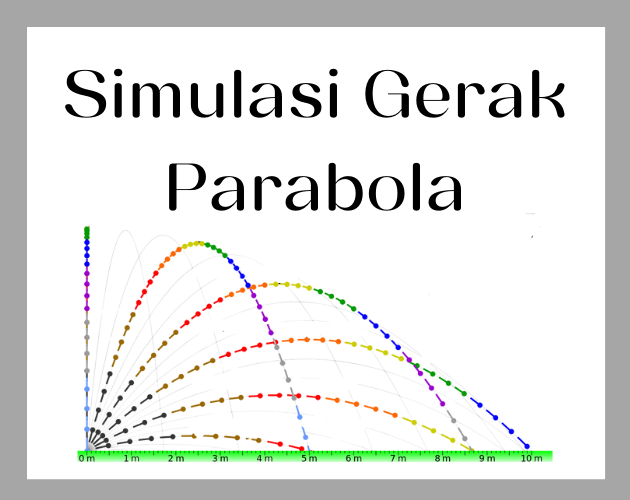
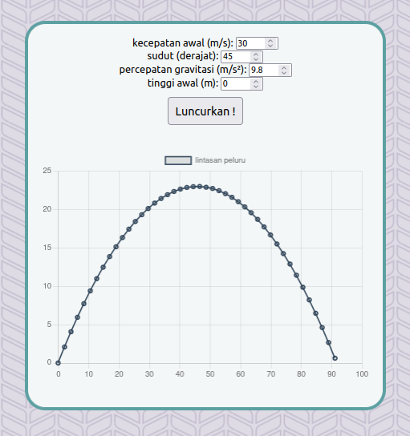

# Pelajari Fisika dengan Simulasi Gerak Peluru

## Pengertian
Proyek simulasi gerak peluru ini bertujuan untuk memberikan pemahaman visual tentang konsep gerak peluru dalam fisika. Melalui grafik simulasi, pengguna dapat memasukkan parameter seperti kecepatan awal, sudut, percepatan gravitasi, dan tinggi awal untuk melihat lintasan peluru yang dihasilkan.

## Cara Penggunaan
1. **Masuk ke Halaman itch.io:**
   - Buka halaman proyek simulasi gerak peluru di itch.io ([Simulasi Gerak Parabola](https://keinan21.itch.io/simulasi-gerak-parabola)).

2. **Masukkan Parameter:**
   - Isi nilai kecepatan awal ($V_0$) (m/s), sudut peluncuran ($\theta$) (derajat), percepatan gravitasi ($g$) (m/s²), dan tinggi awal ($h$) (m).
   - Pastikan nilai yang dimasukkan sesuai dengan batasan yang telah ditentukan.

3. **Klik "Luncurkan!":**
   - Setelah mengisi parameter, klik tombol "Luncurkan!" untuk memulai simulasi.

4. **Lihat Grafik Lintasan:**
   - Grafik lintasan peluru akan muncul, menampilkan perubahan posisi peluru seiring waktu.

## Cara Kerja dan Rumus yang Digunakan

Simulasi ini melibatkan beberapa langkah untuk menghasilkan grafik lintasan peluru yang akurat:

1. **Langkah 1:** Hitung Kecepatan Awal Horizontal dan Vertikal.
   - Kecepatan awal horizontal ($V_x$) dihitung dengan $V_x = V_0 \cdot \cos(\theta)$, dan kecepatan awal vertikal ($V_y$) dihitung dengan $V_y = V_0 \cdot \sin(\theta)$.

2. **Langkah 2:** Hitung Waktu Puncak ($t_{\text{puncak}}$) dan Tinggi Puncak ($h_{\text{puncak}}$).
   - Waktu puncak ($t_{\text{puncak}}$) dihitung dengan $t_{\text{puncak}} = \frac{V_y}{g}$, dan tinggi puncak ($h_{\text{puncak}}$) dihitung dengan $h_{\text{puncak}} = h + \frac{V_y^2}{2 \cdot g}$.

3. **Langkah 3:** Hitung Posisi Horizontal ($x$).
   - Posisi horizontal ($x$) dihitung dengan $x(t) = V_x \cdot t$.

4. **Langkah 4:** Hitung Posisi Vertikal ($y$).
   - Posisi vertikal ($y$) saat naik dihitung dengan $y(t) = h + V_y \cdot t - \frac{1}{2} \cdot g \cdot t^2$.

5. **Langkah 5:** Tentukan Posisi Vertikal Setelah Titik Puncak ($y$ setelah puncak).
   - Posisi vertikal setelah titik puncak dihitung dengan rumus gerak jatuh bebas: $y_{\text{jatuh bebas}}(t) = h_{\text{puncak}} - \frac{1}{2} \cdot g \cdot (t - t_{\text{puncak}})^2$.

## Screenshots

## Quotes
> "Simulasi gerak peluru adalah jendela interaktif ke dalam dunia fisika, memungkinkan kita untuk melihat bagaimana parameter yang berbeda mempengaruhi lintasan sebuah peluru. Dengan setiap simulasi, kita dapat menggali lebih dalam ke dalam rahasia gerak dan keindahan perjalanan yang tersembunyi di balik setiap tembakan."

Semoga proyek simulasi gerak peluru ini memberikan pemahaman yang lebih baik tentang konsep fisika yang menarik dan dapat menjadi sarana pembelajaran yang bermanfaat!
